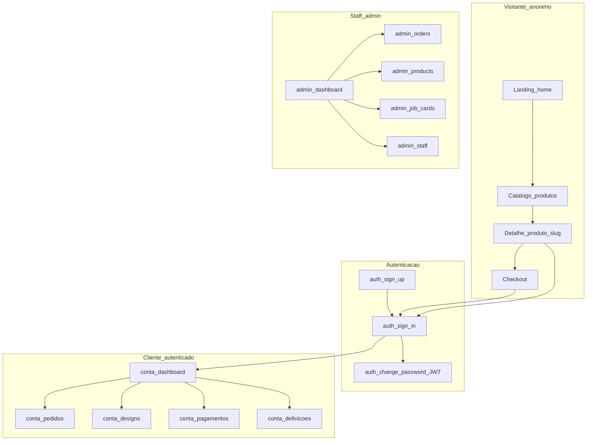

# Documentação geral e mapa de fluxos Construvasco (frontend)

## O que a app resolve para a empresa (síntese inferida do código)

Com base em rotas, módulos e constantes em [`src/app/app.routes.ts`](c:\Users\user\Documents\americo_magumba\Construvasco\app\construvasco_frontend_v1\src\app\app.routes.ts), [`src/app/modules/landing/landing.routes.ts`](c:\Users\user\Documents\americo_magumba\Construvasco\app\construvasco_frontend_v1\src\app\modules\landing\landing.routes.ts) e [`src/app/shared/constants/api-endpoints.ts`](c:\Users\user\Documents\americo_magumba\Construvasco\app\construvasco_frontend_v1\src\app\shared\constants\api-endpoints.ts), o frontend suporta um ecossistema em que a Construvasco:

- **Presença digital e vendas**: site público com **catálogo de “projetos”/produtos** (`/produtos`, `/products/:slug`), **checkout** e canais de contacto; objetivo típico: captar pedidos e orientar o cliente sem depender só de WhatsApp/manual.
- **Área do cliente (`/conta`)**: após autenticação, o cliente consulta **dashboard**, **pedidos**, conteúdos guardados (**designs**), **métodos de pagamento** e **definições** (incl. alteração de palavra-passe com sessão ativa, alinhado com o fluxo atual de auth).
- **Operação interna (`/admin`)**: backoffice para **produtos**, **categorias**, **designs**, **pedidos** (lista, criação, kanban), **job cards** (fluxo de trabalho design/produção), **staff** e definições — ou seja, **padronizar e acompanhar** o trabalho da equipa e o estado dos pedidos num só sítio.

**Nota importante:** a narrativa exacta de posicionamento (“somos X para o mercado Y”) deve ser validada contigo; o parágrafo acima descreve **capacidades observáveis no código**, não marketing oficial.

---

## Mapa geral de funcionamento (fluxos)

Diagrama lógico de alto nível (executável mentalmente e reproduzível em Mermaid nos docs):

**Fluxo de dados típico (resumo):** o browser chama a API Laravel (base URL via [`ConfigService`](c:\Users\user\Documents\americo_magumba\Construvasco\app\construvasco_frontend_v1\src\app\core\services) / environment); o [`authInterceptor`](c:\Users\user\Documents\americo_magumba\Construvasco\app\construvasco_frontend_v1\src\app\core\auth\interceptors\auth.interceptor.ts) anexa `Bearer` às rotas protegidas, com excepções explícitas para login/registo/Google; guards [`auth.guard`](c:\Users\user\Documents\americo_magumba\Construvasco\app\construvasco_frontend_v1\src\app\core\auth\guards\auth.guard.ts) / [`noAuth.guard`](c:\Users\user\Documents\americo_magumba\Construvasco\app\construvasco_frontend_v1\src\app\core\auth\guards\no-auth.guard.ts) / [`admin.guard`](c:\Users\user\Documents\americo_magumba\Construvasco\app\construvasco_frontend_v1\src\app\core\auth\guards\admin.guard.ts) segmentam rotas.

---

## O que falta hoje no repositório frontend (lacunas de documentação)

| Área | Estado actual | Lacuna |
|------|---------------|--------|
| **README raiz** | Texto genérico Fuse/Angular CLI ([`README.md`](c:\Users\user\Documents\americo_magumba\Construvasco\app\construvasco_frontend_v1\README.md)) | Não identifica Construvasco, não explica módulos, env, nem como ligar ao Laravel |
| **Arquitectura** | Código disperso por `modules/`, `core/`, `layout/` | Falta um documento que liste **camadas**, **rotas principais**, **guards**, **interceptors** e convenções |
| **Fluxos de negócio** | Implícito nas rotas | Falta narrativa “visitante → pedido → pagamento → conta” e “admin → pedido → job card” com links para pastas |
| **API / contratos** | [`api-endpoints.ts`](c:\Users\user\Documents\americo_magumba\Construvasco\app\construvasco_frontend_v1\src\app\shared\constants\api-endpoints.ts) mistura domínios (ex.: candidates/jobs vs produtos) | Documentar quais prefixos são **activos** para Construvasco e referenciar o repositório backend como fonte de verdade das rotas |
| **Onboarding dev** | Só `ng serve` genérico | Variáveis (`environment.ts`), CORS, Google Client ID, URLs da API |
| **ADRs / decisões** | Não visível | Opcional: decisões já tomadas (ex.: sem reset público de senha; JWT; layouts `empty`) |

---

## Entregáveis propostos (após saíres do modo plano)

1. **Substituir ou reescrever** [`README.md`](c:\Users\user\Documents\americo_magumba\Construvasco\app\construvasco_frontend_v1\README.md): visão Construvasco, pré-requisitos, `ng serve`, build, ligação à API, estrutura de pastas em 1 página.
2. **Criar** `docs/PRODUTO_E_VALOR.md`: problema da empresa, públicos-alvo (visitante, cliente, admin), métricas de sucesso sugeridas (tu podes afinar).
3. **Criar** `docs/ARQUITETURA_E_FLUXOS.md`: o diagrama Mermaid acima (ou versão expandida), tabela de rotas (`/`, `/produtos`, `/conta/...`, `/admin/...`, `/auth/...`), referência a guards e auth.
4. **Criar** `docs/DESENVOLVIMENTO.md`: environments, interceptors, como depurar auth, onde está o `AuthService` canónico ([`src/app/core/auth/services/auth.service.ts`](c:\Users\user\Documents\americo_magumba\Construvasco\app\construvasco_frontend_v1\src\app\core\auth\services\auth.service.ts)).
5. **Ligação ao backend**: uma secção no README ou em `docs/INTEGRACAO_API.md` apontando para [`construvasco_laravel_v1`](c:\Users\user\Documents\americo_magumba\Construvasco\app\construvasco_laravel_v1) (sem duplicar toda a doc do servidor).

Nenhuma alteração de runtime é obrigatória para cumprir o pedido de “documentação geral”; o trabalho é sobretudo **Markdown no repo** e alinhamento da narrativa contigo.
