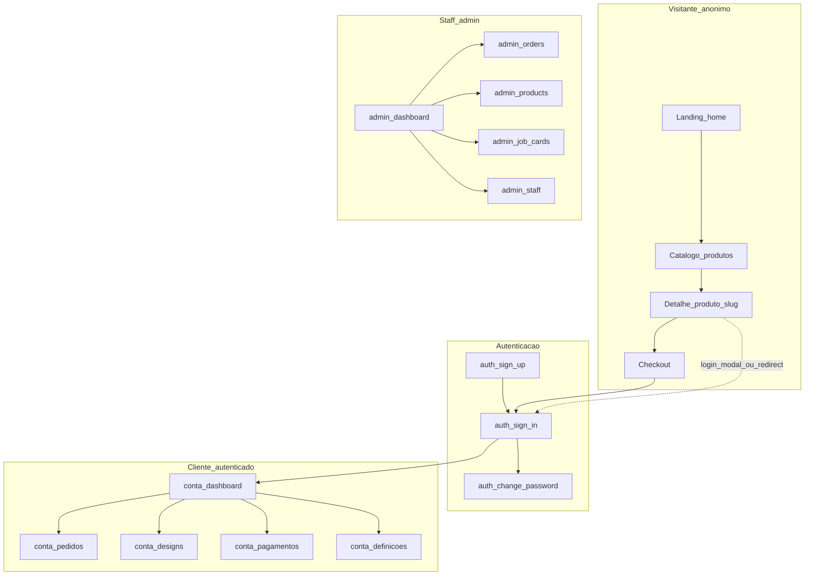

# Arquitectura e fluxos — Construvasco (frontend)

## Visão em camadas

1. **Router (Angular)**: define URLs, lazy loading e `data` (ex.: `layout: 'empty'`).
2. **Guards**: `authGuard`, `noAuthGuard`, `adminGuard` em `src/app/core/auth/guards/`.
3. **Layout**: `LayoutComponent` (`src/app/layout/`) envolve rotas com o shell Fuse.
4. **Módulos de funcionalidade**: `landing`, `auth`, `account`, `admin` sob `src/app/modules/`.
5. **Core**: `AuthService`, `UserService`, `ConfigService`, interceptors HTTP.
6. **Shared**: componentes reutilizáveis (header, modais, paginação) e constantes.

## Mapa de fluxos (alto nível)

Notas:

- O visitante pode autenticar-se via **modal** no header (landing) ou páginas em `/auth/*`.
- Rotas antigas `forgot-password`, `reset-password`, `redefinir-senha/:token` redireccionam para `sign-in`; alteração de palavra-passe com sessão em `/auth/change-password` e definições da conta.

## Rotas principais (referência)

Definição canónica: [`src/app/app.routes.ts`](../src/app/app.routes.ts). Landing filha: [`src/app/modules/landing/landing.routes.ts`](../src/app/modules/landing/landing.routes.ts).

| Prefixo | Público | Descrição |
|---------|---------|-----------|
| `/` | Sim | Home landing |
| `/produtos` | Sim | Catálogo (filhas em `products.routes`) |
| `/products/:slug` | Sim | Detalhe por slug |
| `/checkout` | Sim | Checkout |
| `/auth/sign-in`, `/auth/sign-up` | Sim (guest) | Páginas de entrada |
| `/auth/change-password` | Não | JWT + `authGuard`; também fluxo `must_change` |
| `/conta/*` | Não | Área cliente (`authGuard` + `canActivateChild`) |
| `/admin/*` | Não | Backoffice (`adminGuard`) |

Redireccionamentos úteis em `landing.routes.ts`: por exemplo `/servicos` → `/produtos`, `/contacto` → `/checkout` (ver ficheiro para lista actual).

## Autenticação e autorização

| Ficheiro | Papel |
|----------|-------|
| [`auth.service.ts`](../src/app/core/auth/services/auth.service.ts) | Login, registo, logout, refresh, Google, `changePassword`; token em `localStorage` (`access_token`). |
| [`auth.interceptor.ts`](../src/app/core/auth/interceptors/auth.interceptor.ts) | Anexa `Authorization: Bearer` excepto em rotas públicas explícitas (login, register, google). |
| [`auth.guard.ts`](../src/app/core/auth/guards/auth.guard.ts) | Protecção de rotas autenticadas; redirecção para change-password se `must_change`. |
| [`no-auth.guard.ts`](../src/app/core/auth/guards/no-auth.guard.ts) | Impede acesso a sign-in/sign-up quando já autenticado. |
| [`admin.guard.ts`](../src/app/core/auth/guards/admin.guard.ts) | Restringe `/admin` a perfis administrativos. |

## Admin: sub-rotas (resumo)

Sob `/admin` (lazy): `dashboard`, `settings`, `products` (list/create/edit/detail), `designs`, `orders` (list/create/kanban/detail), `categories`, `staff`, `job-cards` (list/kanban/create/detail). Detalhe exacto em `app.routes.ts`.

## Decisões já reflectidas no código (útil para onboarding)

- **JWT** na API; refresh configurado no `AuthService`.
- **Sem recuperação pública de senha por email**: mensagens na UI orientam alteração em **Conta → Definições** após login.
- **Layout `empty`** nas áreas públicas e conta para controlar chrome Fuse vs site.
